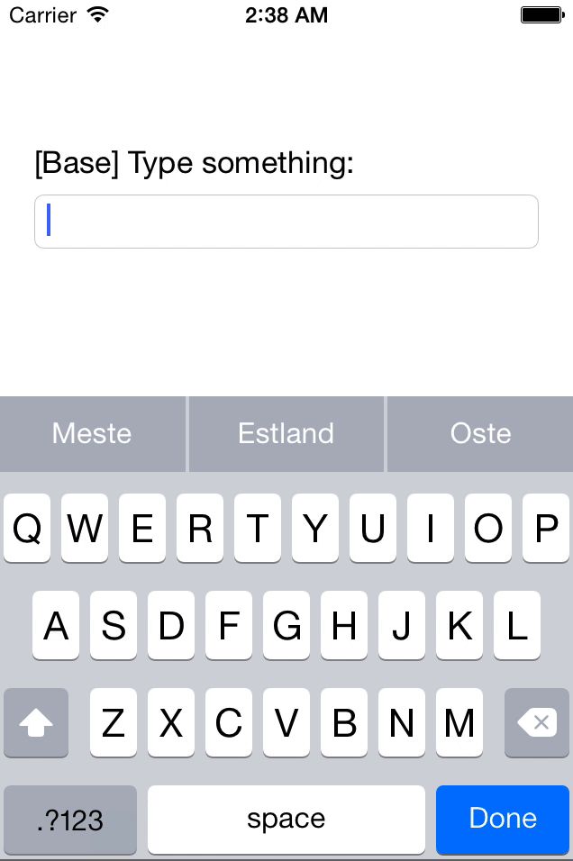

# TOMSSuggestionBar
Smoothly animated suggestions for text inputs with super easy CoreData hook.
The main approach of this project is to make  accessible for developers.
With TOMSSuggestionBar you can easily mimic its appearance and behavior but provide your custom datasource.

## Demo



## Installation with CocoaPods

TOMSMorphingLabel is available through [CocoaPods](http://cocoapods.org). To install
it, simply add the following line to your Podfile:

#### Podfile

```ruby
platform :ios, '7.0'
pod "TOMSSuggestionBar", "~> 0.1.0"
```

## Quick Start

Simply instantiate TOMSSuggestionBar and subscribe a textField to the suggestions.
The following suggestionBar would suggest `name` values of instances of type `Person` which was defined in `Model.xcdatamodeld`.

```objective-c
TOMSSuggestionBar *suggestionBar = [[TOMSSuggestionBar alloc] init];
[suggestionBar subscribeTextInputView:self.textField
       toSuggestionsForAttributeNamed:@"name"
                        ofEntityNamed:@"Person"
                         inModelNamed:@"Model"];
```

## Customization

### Appearance

The suggestionBars appearance can be easily modified.

```objective-c
/**
Instantiate a suggestionBar with an alternative number of suggestionFields.
*/
TOMSSuggestionBar *suggestionBar = [[TOMSSuggestionBar alloc] initWithNumberOfSuggestionFields:5];

/**
Easily customize the bars colors and font.
*/
suggestionBar.backgroundColor = [UIColor redColor];
suggestionBar.tileColor = [UIColor greenColor];
suggestionBar.textColor = [UIColor blueColor];
suggestionBar.font = [UIFont systemFontOfSize:18];
```

### Delegate or DataSource

You may adopt `TOMSSuggestionDelegate` or `TOMSSuggestionDataSource` and register as the suggestionBars `delegate` or `dataSource`.

#### Delegate protocol

```objective-c
/**
 Gets called when a suggestion tile is tapped.

 @param suggestionBar The suggestionBar containing the tapped tile.
 @param suggestion The text on the tapped tile.
 @param associatedObject The instance fetched from CoreData that is represented by the tapped text.
 */
- (void)suggestionBar:(TOMSSuggestionBar *)suggestionBar
  didSelectSuggestion:(NSString *)suggestion
     associatedObject:(NSManagedObject *)associatedObject;
```

#### DataSource protocol

```objective-c
/**
 Returns a `NSString` that is a substring of the overall textInput. It represents the substring that is relevant for fetching instances from CoreData for suggestions.

 @param suggestionBar The suggestionBar that is displaying the contents.
 @param textInput The whole text within the suggestionBars subscribed textInput.
 @param caretLocation The location of the caret.
 */
- (NSString *)suggestionBar:(TOMSSuggestionBar *)suggestionBar
    relevantContextForInput:(NSString *)textInput
              caretLocation:(NSInteger)caretLocation;

/**
 Returns a `NSPredicate` to define a fetch request for a specific context.

 @param suggestionBar The suggestionBar that is displaying the contents.
 @param context The currently relevant textsnipped that should be used in the predicate.
 @param attributeName The name of the attribute that values are displayed of.
 */
- (NSPredicate *)suggestionBar:(TOMSSuggestionBar *)suggestionBar
           predicateForContext:(NSString *)context
                 attributeName:(NSString *)attributeName;

/**
 Returns a `NSArray` of `NSSortDescriptor` to specify the order in which fetched instances are displayed.

 @param suggestionBar The suggestionBar that is displaying the contents.
 @param attributeName The name of the attribute that values are displayed of.
 */
- (NSArray *)suggestionBar:(TOMSSuggestionBar *)suggestionBar
sortDescriptorsForAttributeName:(NSString *)attributeName;
```

#### Exemplary implementation

An implementation of Delegate and DataSource could look like the following example.

The succeeding example of the delegate simply replaces the last word in the text field with the tapped suggestion.

The succeeding example of the dataSource works quite similar to the internals default configuration.
It returns the last word of the input text as relevant context. The predicate for fetching attribute values is implemented as fuzzy matching.

```objective-c
- (void)viewDidLoad
{
    [super viewDidLoad];

    TOMSSuggestionBar *suggestionBar = [[TOMSSuggestionBar alloc] init];
    [suggestionBar subscribeTextInputView:self.textField
           toSuggestionsForAttributeNamed:@"name"
                            ofEntityNamed:@"Person"
                             inModelNamed:@"Model"];

    suggestionBar.delegate = self;
    suggestionBar.dataSource = self;
}

#pragma mark - TOMSSuggestionDelegate

- (void)suggestionBar:(TOMSSuggestionBar *)suggestionBar
  didSelectSuggestion:(NSString *)suggestion
     associatedObject:(NSManagedObject *)associatedObject
{
    NSString *replacement = [suggestion stringByAppendingString:@" "];
    self.textField.text = [self.textField.text stringByReplacingCharactersInRange:[suggestionBar rangeOfRelevantContext]
                                                                       withString:replacement];
}

#pragma mark - TOMSSuggestionDataSource

- (NSString *)suggestionBar:(TOMSSuggestionBar *)suggestionBar
    relevantContextForInput:(NSString *)textInput
              caretLocation:(NSInteger)caretLocation
{
    NSRange lastWordRange = [textInput rangeOfString:@" "
                                             options:NSBackwardsSearch];

    NSString *relevantContext;
    if (lastWordRange.location == NSNotFound) {
        relevantContext = textInput;
    } else {
        relevantContext = [textInput substringFromIndex:lastWordRange.location + 1];
    }

    return relevantContext;
}

- (NSPredicate *)suggestionBar:(TOMSSuggestionBar *)suggestionBar
           predicateForContext:(NSString *)context
                 attributeName:(NSString *)attributeName
{
    return [NSPredicate predicateWithFormat:@"%K LIKE[cd] %@", attributeName, [NSString stringWithFormat:@"*%@*", context]];
}

- (NSArray *)suggestionBar:(TOMSSuggestionBar *)suggestionBar sortDescriptorsForAttributeName:(NSString *)attributeName
{
    return @[[NSSortDescriptor sortDescriptorWithKey:attributeName ascending:YES]];
}
```

## Author

[Tom König](http://github.com/TomKnig) [@TomKnig](https://twitter.com/TomKnig)

## License

TOMSSuggestionBar is available under the MIT license. See the LICENSE file for more info.
